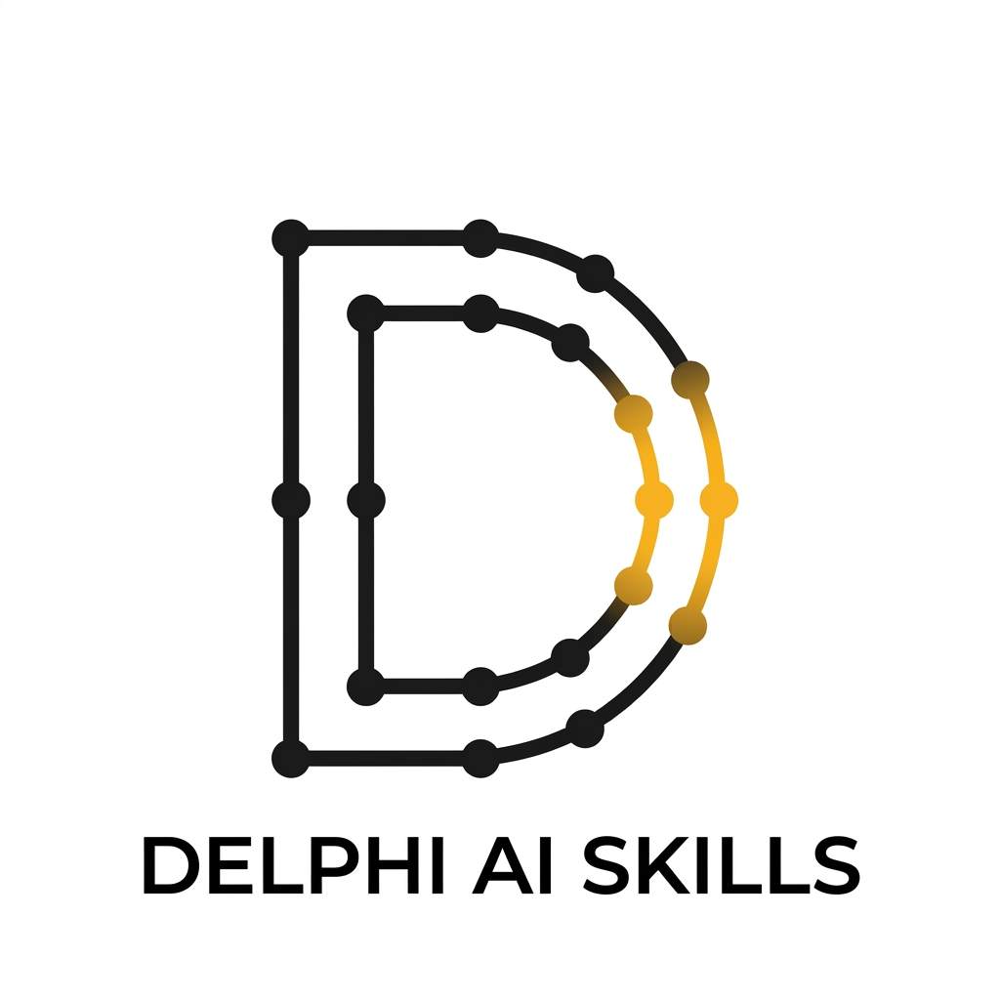

<p align="center">
  
</p>

<p align="center">
  AI coding-agent <strong>skills</strong> for
  <a href="https://github.com/danieleteti/delphimvcframework">DelphiMVCFramework</a>.
</p>

<p align="center">
  
  
  
</p>

**Version 0.1.0 — early release.** Written and verified against **DelphiMVCFramework 3.5.0** (`silicon`), but
not yet battle-tested across many projects: expect rough edges, and please report them.

A *skill* is a Markdown file your AI agent loads **on demand**, when your request matches it. It teaches the
agent the framework's real API — exact unit names, attributes, ownership rules, idioms — so it stops
inventing plausible-but-wrong code. Every API name here was verified against the DelphiMVCFramework sources
and its sample projects, not written from memory.

Works with Claude Code, Codex, Cursor, Gemini CLI, Windsurf, Continue, and anything else that can read
Markdown instructions.

---

## Quick start

**1. Clone**

```bash
git clone https://github.com/danieleteti/delphi-ai-skills.git
```

**2. Install** — run the script for your agent (Windows):

```bat
cd delphi-ai-skills
install_in_claude.bat
```

That is it for Claude Code: it discovers skills on its own. For the other agents see
[Installing](#installing) — there is a script for each.

**3. Create your project with the IDE wizard** — the skills add features to a wizard project, they do not
scaffold one from scratch:

> **Delphi IDE → File → New → Other → Delphi Projects → DelphiMVCFramework → New DMVCFramework Application**

Pick the preset you need, accept the defaults, compile and run it once.

**4. Start the agent inside the project folder** and ask for what you want:

> *Add a Customers controller with full CRUD, backed by an ActiveRecord entity on table `customers`*

The agent reads the project, loads the right skills, and writes code against the real API.

---

## The skills

| Skill | What it covers | Loads when you… |
|-------|----------------|-----------------|
| **`dmvcframework`** | The core: engine bootstrap and the server backends, controllers and functional actions, routing attributes, `IMVCResponse`, object-ownership rules, ActiveRecord ORM, the Repository pattern, the DI service container, validation, middleware, JWT, SSE, dotEnv configuration. | Build a REST API or any server-side feature with controller classes. |
| **`dmvcframework-minimal-api`** | The Minimal API: lambda routes with no controller class — route groups (`Prefix`, `MapGet`/`MapPost`/`MapMethods`), type-driven parameter binding, records from the query string, file uploads, endpoint filters vs HTTP filters, `.AsWeb` for TemplatePro/HTMX handlers. | Write routes as anonymous methods instead of controller classes — REST *or* web app. |
| **`dmvcframework-webapp`** | Server-side web apps: TemplatePro templates (inheritance, blocks, filters, partials), fragments, `ViewData` and its ownership rules, cookie/JWT login, static files, the HTMX helpers on the Delphi side. | Render HTML pages and HTMX fragments from Delphi. |
| **`dmvcframework-ui`** | The presentation layer the wizard generates: Bootstrap 5.3, `baselayout.html` blocks, the brand tokens in `style.css`, dark/light mode via `data-bs-theme`, toasts, the HTMX activity classes. | Write markup or CSS for a DMVCFramework web app. |
| **`dmvcframework-security`** | Secure coding, with the DMVCFramework API that implements each control: access control and IDOR, mass assignment, SQL injection, XSS in TemplatePro, CSRF, path traversal, uploads, SSRF and open redirect, security headers, JWT hardening, secrets. | Automatically — the server skills require it for any endpoint that takes client input. |
| **`dmvcframework-testing`** | Integration and unit tests: an in-process `IMVCServer` + `IMVCRESTClient` + DUnitX; CRUD, authentication and authorization test patterns; database fixtures. | Write tests for a DMVCFramework API. |
| **`htmx-skill`** | An index of every page of the official htmx.org documentation, each with a description, so the agent fetches and reads the right page instead of recalling htmx from memory. | Ask about any htmx attribute, trigger/swap modifier, event, header or extension. |

They are complementary: the Minimal API and web-app skills assume the core one for entities, validation and
DI. All four server skills require `dmvcframework-security` for any endpoint that touches untrusted input.
The web-app skill delegates markup to `dmvcframework-ui` and htmx syntax to `htmx-skill` rather than
duplicating either. **Install them all** — the agent picks the right ones on its own.

### Two things the skills insist on

**1. Start from a wizard project.** The skills do not scaffold a project from scratch. Create it in the IDE,
accept the defaults, compile it, then `cd` into the folder and start your agent **there**. The skills detect
the wizard layout (`EngineConfigU.pas`, `RoutesU.pas`, `bin/.env`, …) and add features inside it. If there is
no project, they stop and tell you to create one rather than inventing a half-correct bootstrap.

**2. The server backend is Indy Direct.** For a *new* project: a self-contained executable, no WebModule, no
WebBroker. But an **existing WebBroker project — ISAPI under IIS, an Apache module — is fully supported**:
the skills detect the host, keep it, and never suggest migrating it. Everything above the host (controllers,
routing, ActiveRecord, validation, DI, middleware) is identical on every backend.

---

## Prompts that activate each skill

You do not "call" a skill. You describe the task, and the agent matches it against each skill's description.
The strongest trigger is **naming the framework**: *"create a controller"* is ambiguous, *"create a
**DMVCFramework** controller"* is not. Once a skill is loaded, the rest of the conversation keeps it.

**`dmvcframework`** — REST API, ORM, DI, validation

> *Create a DMVCFramework REST controller for Customers with GET/POST/PUT/DELETE*
> *Add a TMVCActiveRecord entity mapped to the `orders` table with a nullable delivery date*
> *Validate this DTO: name required, email valid, age between 18 and 120*
> *Register a service in the DI container and inject it into the controller*
> *Move the port and the connection string into .env*
> *Add JWT authentication to my DMVC API*
> *Push live updates to the browser with SSE*

**`dmvcframework-minimal-api`** — lambda routes

> *Write this as a DMVCFramework Minimal API — no controller classes*
> *Add a MapGet route with a route parameter and a query-string filter*
> *Protect the /admin route group with an auth filter*
> *Handle a file upload in a minimal API endpoint*

**`dmvcframework-webapp`** — TemplatePro + HTMX

> *Add a page that lists customers, using TemplatePro*
> *Return an HTMX fragment when the request comes from htmx, the full page otherwise*
> *Set up template inheritance with a baselayout*
> *Add cookie-based JWT login to my web app*

**`dmvcframework-ui`** — layout and CSS

> *Add a Customers entry to the navbar*
> *Style this list as Bootstrap cards*
> *Show a toast when the customer is saved*
> *Make this table look right in dark mode*

**`dmvcframework-security`** — usually loads on its own, pulled in by the others. Ask it directly for a review:

> *Review this controller for security issues*
> *Can a user read someone else's order through this endpoint?*
> *Is this file upload safe?*

**`dmvcframework-testing`** — DUnitX

> *Write integration tests for the Customers endpoints*
> *Add a test that a POST with an invalid email returns 422*
> *Add a test that user B cannot read user A's order*

**`htmx-skill`** — htmx reference

> *What does hx-swap="outerHTML swap:1s" actually do?*
> *Which HTMX event fires after the swap completes?*

### Checking it worked

Claude Code prints the skill it loaded. If it did not load, say so explicitly:

> *Use the dmvcframework skill. Then create a controller for Orders.*

A ten-second way to tell a skilled agent from an unskilled one — ask:

> *In a DMVCFramework functional action, do I need `ToFree` on the object I return?*

The right answer is **no: the framework frees the returned object, and `ToFree` would free it twice**. An
agent without the skill usually says yes, and its code double-frees.

---

## Installing

Each skill is a folder under `skills/` with a `SKILL.md` inside. Copy the **whole folder** — the core skill
has `reference/` files that must sit next to its `SKILL.md`.

### The scripts (Windows)

Run them from the folder where you cloned this repo. Each one is safe to re-run: it overwrites the skills and
never duplicates the section it adds to your instruction file.

| Script | What it does |
|--------|--------------|
| `install_in_claude.bat` | Installs for your user (`%USERPROFILE%\.claude\skills`). Claude Code discovers them — nothing else to configure. |
| `install_in_claude.bat <project>` | Installs into that project's `.claude\skills\` instead, so you can commit them for your team. Pass `.` for the current folder. |
| `install_in_codex.bat [project]` | Copies `skills\` into the project **and** appends a Skills section to `AGENTS.md`. |
| `install_in_cursor.bat [project]` | Copies `skills\` **and** writes one `.cursor\rules\*.mdc` per skill (with `alwaysApply: false`, so they load only when relevant). |
| `install_in_gemini.bat [project]` | Copies `skills\` **and** appends a Skills section to `GEMINI.md`. |

Codex, Cursor and Gemini do not auto-discover skills, which is why those scripts also write the pointer — the
agent has to be told the files exist and when to read them.

### Claude Code — by hand

If you would rather not run a script:

```powershell
# PowerShell
Copy-Item -Recurse -Force .\delphi-ai-skills\skills\* "$env:USERPROFILE\.claude\skills\"
```
```bash
# Git Bash / macOS / Linux
cp -r delphi-ai-skills/skills/* ~/.claude/skills/
```

To stay current with a `git pull`, symlink rather than copy (PowerShell, with Developer Mode on or as
Administrator):

```powershell
foreach ($s in Get-ChildItem .\delphi-ai-skills\skills -Directory) {
  New-Item -ItemType SymbolicLink -Force `
    -Path "$env:USERPROFILE\.claude\skills\$($s.Name)" -Target $s.FullName
}
```

### Codex, or any agent that reads `AGENTS.md` — by hand

`install_in_codex.bat` does this for you. By hand: copy `skills/` into your project, then tell the agent the
files exist and when to open them:

```markdown
## Skills

Before writing DelphiMVCFramework code, read the relevant skill:

- `skills/dmvcframework/SKILL.md` — controllers, ActiveRecord, validation, DI, middleware, servers, dotEnv
- `skills/dmvcframework-minimal-api/SKILL.md` — lambda routes, route groups, filters
- `skills/dmvcframework-webapp/SKILL.md` — TemplatePro views, fragments, ViewData
- `skills/dmvcframework-ui/SKILL.md` — Bootstrap 5.3 layout, style.css, dark mode
- `skills/dmvcframework-security/SKILL.md` — REQUIRED for any endpoint taking client input
- `skills/dmvcframework-testing/SKILL.md` — DUnitX integration tests
- `skills/htmx-skill/SKILL.md` — index of the official htmx.org docs

Do not write DMVCFramework code from memory: the API names in these files are authoritative.
```

### Cursor — by hand

`install_in_cursor.bat` does this for you. Cursor loads rules from `.cursor/rules/*.mdc`. Give each skill a rule whose `description` tells Cursor when to
pull it in, and reference the skill file rather than duplicating it:

`.cursor/rules/dmvcframework.mdc`

```markdown
---
description: DelphiMVCFramework — controllers, ActiveRecord, validation, DI, middleware, servers
globs: ["**/*.pas", "**/*.dpr"]
alwaysApply: false
---

@skills/dmvcframework/SKILL.md
```

Repeat for the other skills, changing `description` and the `@` path. Keep `alwaysApply: false` so they stay
out of context until relevant.

### Gemini CLI — by hand

`install_in_gemini.bat` does this for you. Otherwise: copy `skills/` into the project and list the files in `GEMINI.md`, exactly as in the `AGENTS.md` example
above. Gemini reads `GEMINI.md` at startup and opens the referenced file when the task matches.

### Windsurf, Continue, and the rest

Same recipe: commit `skills/` to your repo, add a short section to that agent's instruction file listing the
skills and when to read each. The skills are plain Markdown with no tool-specific syntax.

### No configuration at all

Paste the relevant `SKILL.md` into the chat before asking for code. Less convenient, works with any model.

---

## Layout

The core skill keeps its bulk out of the way: `SKILL.md` is the working core (bootstrap, controllers,
responses, ownership, middleware, pitfalls), and the heavy material sits in files the agent opens only when
the task calls for them.

```
install_in_claude.bat             installers - see Installing
install_in_codex.bat
install_in_cursor.bat
install_in_gemini.bat
skills/
  dmvcframework/
    SKILL.md
    reference/servers.md            Indy Direct (default) · HTTP.sys · WebBroker/ISAPI/Apache · FireDAC
    reference/dotenv.md             Boot pattern, profiles, precedence, .env syntax, secrets
    reference/activerecord.md       the ORM: mapping, CRUD, RQL, hooks, soft delete, versioning,
                                    the connection middleware, the automatic REST CRUD controller
    reference/di-and-repository.md  service container · IMVCRepository<T>
    reference/validation.md         validator attributes · OnValidate · the real 422 body
    reference/sse.md                TMVCSSEController · SSEBroker
    scripts/build.bat               build a project with the newest installed Delphi
    scripts/run.bat                 run it
  dmvcframework-minimal-api/SKILL.md
  dmvcframework-webapp/SKILL.md
  dmvcframework-ui/SKILL.md
  dmvcframework-security/SKILL.md
  dmvcframework-testing/
    SKILL.md
    scripts/run-tests.bat           build and run a DUnitX test project
  htmx-skill/SKILL.md
```

---

## Why these skills exist

Ask an agent for a DelphiMVCFramework Minimal API without them and you get confident, well-shaped,
**uncompilable** code: `MapGroup` instead of `Prefix`, `OkResponse` instead of `Ok`, middleware classes that
do not exist, a `ToFree` around the returned object that frees it twice. The names are plausible — they are
what the framework *would* be called if it were ASP.NET.

Each skill was built by running that failure first, documenting the API the framework really has, then
re-running the same task to confirm the agent gets it right.

---

## Versioning

| | |
|---|---|
| **Skills version** | **0.1.0** (pre-1.0) |
| **Targets DelphiMVCFramework** | **3.5.0** (`silicon`) |
| Delphi | The framework supports 10 Seattle and later; the wizard projects these skills assume target 11 Alexandria or later |

The skills version is independent of the framework's.

**While on 0.x**, treat the shape of the skill set as unsettled: skills may be split, merged, renamed or
dropped between minor versions as real use shows what actually helps. 1.0.0 will follow once the set has
proven itself on real projects. From then on: **major** when a skill is removed or restructured in a way that
breaks how you invoke it, **minor** when a skill is added or new API coverage lands, **patch** for a
correction.

**The skills know they can be out of date.** Each one instructs the agent that, when it needs a signature the
skill does not cover, it must *verify rather than guess*: first by asking you for the path to your local
DelphiMVCFramework checkout (reading `sources/` and the matching `samples/` project), otherwise by reading the
official repository —

- Sources: https://github.com/danieleteti/delphimvcframework/tree/master/sources
- Samples: https://github.com/danieleteti/delphimvcframework/tree/master/samples

— and, failing that, by saying plainly that it is not sure. **Where a skill and a sample disagree, the sample
wins**, and the skill has a bug.

**Pointing the agent at your checkout up front makes it sharper.** If you have the framework on disk, say so:
*"the DMVCFramework sources are in C:\DEV\dmvcframework"*.

### Changelog

**0.1.0** — first public release. Seven skills, every API name verified against the DelphiMVCFramework 3.5.0
sources and samples.

Some of what an unaided agent gets wrong, and these skills get right: `ToFree` on a returned object is a
double free; the CORS and JWT middleware classes are `TMVCCORSMiddleware` and
`TMVCJWTAuthenticationMiddleware`; `MVCFramework.Validators.CrossField` does not exist; validation triggers on
any validator attribute, not only on `TMVCValidatable`; the DI container is built once in the `.dpr`, not per
request; `ViewData` owns nothing, so you free what you put in it; the Minimal API DSL is `Prefix` and `Ok`,
not `MapGroup` and `OkResponse`; `[MVCRequiresRole]` compiles but does nothing without the role-based auth
handler.

---

## Contributing

Found an API the skills get wrong, or a pattern they are missing? Open an issue or a PR. One rule: every claim
must be verifiable against the DelphiMVCFramework source or a sample project — cite the file. No API names
from memory.

## Credits

The secure-coding skill adapts the topic coverage of [VibeSec](https://github.com/BehiSecc/VibeSec-Skill)
(Apache-2.0) to DelphiMVCFramework — every control is rewritten against the framework's real API.

## License

Apache License 2.0 — see [LICENSE](LICENSE).
